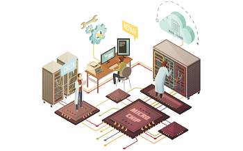

# 

---

| [**Acceuil**](.) | [Projets](./projets) | [Informations](./information) | [Contacts](./contacts) | [Aide](./aide) |
| :---: | :---: | :---: | :---: | :---: |  
|  |  |  |  |  |

---

## Guide d'utilisation

Ce site web me permet de rassembler des projets personnel que je conçois pour passer le temps et/ou à me former sur divers notions avec différentes technique et approche. Étant un passionné de la conception de systèmes électroniques, j'aime me livrer à quelque conception sans limite de temps, budget ou autre contraintes. Cela permet d'imaginer des systèmes un peu farfelus ou au contraire très simples, voire trop simples et utilisable que dans des circonstances bien définies, mais pas forcément notifiées ou guidées. En somme des projets qui n'en sont pas vraiment au sens propre.

## Nouveaux projets

